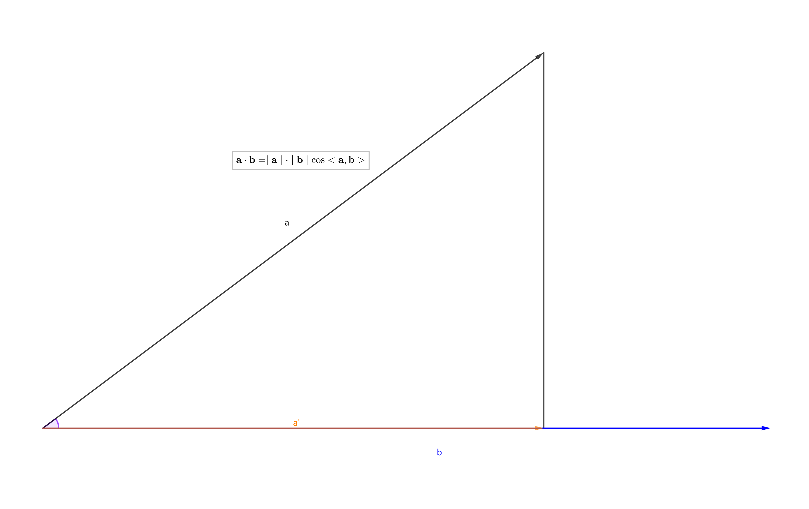

# 向量

## 前言

向量在数学和物理中有着非常重要的应用.
向量是具有大小和方向的量, 它可以形象化地表示为带箭头的线段.
在这份资料中,你将学到:

+ 向量的表示方法
+ 向量的运算
  + 线性运算
  + 点乘
  + 叉乘
  + 运算律
+ 向量的性质

## 向量的表示方法

### 代数表示

一般印刷用黑体的小写英文字母来表示, 如 $\mathbf{a}$, $\mathbf{b}$, $\mathbf{c}$.

手写用在等字母上加一箭头表示, 如 $\vec{a}$, $\vec{b}$, $\vec{c}$.

也可以用大写字母上加一箭头等表示, 如 $\overrightarrow{AB}$, $\overrightarrow{CD}$.

### 几何表示

向量可以用有向线段来表示. 有向线段的长度表示向量的大小. 箭头所指的方向表示向量的方向.
长度为0的向量叫做零向量, 记作$\mathbf{0}$. 记长度等于1个单位的向量叫做单位向量.

### 坐标表示

在平面直角坐标系中, 分别取与x轴, y轴方向相同的两个单位向量$\mathbf{i}$, $\mathbf{j}$作为一组基底.$\mathbf{a}$为平面直角坐标系内的任意向量, 以坐标原点O为起点, P为终点作向量$\mathbf{a}$.由平面向量基本定理可知, 有且只有一对实数$(x, y)$, 使得$\mathbf{a} = x\mathbf{i} + y\mathbf{j}$，因此把实数对$(x, y)$叫做向量$\mathbf{a}$的坐标，记作$\mathbf{a} = (x,y)$. 这就是向量$\mathbf{a}$的坐标表示. 其中$(x,y)$就是点P的坐标, 向量$\mathbf{a}$称为点P的位置向量.

对于多维的空间向量, 可以通过类推得到, 这里不再阐述.

## 向量的运算

令$\mathbf{a} = (x_1, y_1, z_1)$, $\mathbf{b} = (x_2, y_2, z_2)$, $\lambda, \mu为参数$, $<\mathbf{a}, \mathbf{b}>$为向量$\mathbf{a, b}$ 的夹角.

### 线性运算

#### 加法

$\mathbf{a} + \mathbf{b} = (x_1, y_1, z_1) + (x_2, y_2, z_2) = (x_1 + x_2, y_1 + y_2, z_1 + z_2)$

#### 减法

$\mathbf{a} - \mathbf{b} = (x_1, y_1, z_1) - (x_2, y_2, z_2) = (x_1 - x_2, y_1 - y_2, z_1 - z_2)$

#### 数乘

$\lambda\mathbf{a} = \lambda(x_1, y_1, z_1) = (\lambda x_1, \lambda y_1, \lambda z_1)$

### 点乘

$\mathbf{a} \cdot \mathbf{b} = x_1x_2 + y_1y_2 + z_1z_2$

$\mathbf{a} \cdot \mathbf{b} = \mid\mathbf{a}\mid \cdot \mid\mathbf{b}\mid\cos<\mathbf{a}, \mathbf{b}>$

### 叉乘

$\mathbf{a} \times \mathbf{b} = (y_1z_2 - z_1y_2, z_1x_2 - x_1z_2, x_1y_2-y_2x_1)$

$\mid\mathbf{a} \times \mathbf{b}\mid = \mid\mathbf{a}\mid \cdot \mid\mathbf{b}\mid\sin<\mathbf{a}, \mathbf{b}>$

### 运算律

#### 交换律

$\mathbf{a} + \mathbf{b} = \mathbf{b} + \mathbf{a}$

$\mathbf{a} - \mathbf{b} = -\mathbf{b} + \mathbf{a}$

$\mathbf{a} \cdot \mathbf{b} = \mathbf{b} \cdot \mathbf{a}$

$\mathbf{a} \times \mathbf{b} = -\mathbf{b} \times \mathbf{a}$

#### 结合律

$(\mathbf{a} + \mathbf{b}) + \mathbf{c} = \mathbf{a} + (\mathbf{b} + \mathbf{c})$

$(\lambda\mathbf{a}) \cdot \mathbf{b} = \lambda(\mathbf{a} \cdot \mathbf{b})$

$(\lambda\mathbf{a}) \times \mathbf{b} = \lambda(\mathbf{a} \times \mathbf{b})$

#### 分配律

$\lambda( \mathbf{a} + \mathbf{b}) = \lambda\mathbf{a} + \lambda\mathbf{b}$

$(\lambda + \mu)\mathbf{a} = \lambda\mathbf{a} + \mu\mathbf{a}$

$(\mathbf{a} + \mathbf{b}) \cdot \mathbf{c} = \mathbf{a} \cdot \mathbf{c} + \mathbf{b} \cdot \mathbf{c}$

$\mathbf{a} \cdot (\mathbf{b} + \mathbf{c}) = \mathbf{a} \cdot \mathbf{b} + \mathbf{a} \cdot \mathbf{c}$

$(\mathbf{a} + \mathbf{b}) \times \mathbf{c} = \mathbf{a}\times \mathbf{c} + \mathbf{b} \times \mathbf{c}$

$\mathbf{a} \times (\mathbf{b} + \mathbf{c}) = \mathbf{a} \times \mathbf{b} + \mathbf{a} \times \mathbf{c}$

## 向量的性质及应用

### 点乘

#### 计算夹角

以$\mathbf{a} \cdot \mathbf{b}$为例, 点乘的结果表示$\mathbf{a}$在$\mathbf{b}$方向上的投影与$\mid \mathbf{b} \mid$的乘积, 而投影又可表示为$\mathbf{a} \cdot \cos <\mathbf{a}, \mathbf{b}>$,

所以可以利用这一性质来计算两个向量的夹角:$$\cos <\mathbf{a}, \mathbf{b}> = \frac{\mathbf{a} \cdot \mathbf{b}}{\mid \mathbf{a} \mid \cdot \mid \mathbf{b} \mid}$$

特别地, $$\mathbf{a} \cdot \mathbf{b}= 0 \Leftrightarrow \mathbf{a} \perp \mathbf{b}, \ \ \ \ \mathbf{a}, \mathbf{b} \neq \mathbf{0}$$

#### 计算模长

以计算$\mathbf{a}$的模长为例, 已知$\mid \mathbf{a} \mid$.
$$\because \mathbf{a} \cdot \mathbf{a} = \mid\mathbf{a}\mid \cdot \mid\mathbf{a}\mid\cos<\mathbf{a}, \mathbf{a}>= \mid \mathbf{a} \mid ^ 2$$
$$\therefore\mid \mathbf{a} \mid = \sqrt{\mathbf{a} \cdot \mathbf{a}}$$
对于像求$\mid \mathbf{a} + \mathbf{b} \mid$的题目, 只需利用向量的运算律将其转化即可.

#### 极化恒等式

在平面中有三角形ABC, D是BC中点, 则有$\overrightarrow{AB} \cdot \overrightarrow{AC} = \mid AD \mid ^ 2 - \mid BD \mid ^ 2$.

在平面中有向量$\mathbf{a}, \mathbf{b}$, 则有$$\mathbf{a} \cdot \mathbf{b} = \frac{1}{4}[(\mathbf{a} + \mathbf{b}) ^ 2 - (\mathbf{a} - \mathbf{b}) ^ 2]$$

### 叉乘

#### 计算法向量

设$\mathbf{n} = \mathbf{a} \times \mathbf{{b}}$, 很容易证明, $\begin{cases}
\mathbf{n} \perp \mathbf{a}, \\ \mathbf{n} \perp \mathbf{b} \end{cases}$, 所以$\mathbf{n}$是$\mathbf{a}$和$\mathbf{b}$所构成的平面的法向量.

#### 计算面积

设$\triangle ABC$, 则$$S_{\triangle ABC} = \frac{1}{2}\mid \overrightarrow{AB} \times \overrightarrow{AC} \mid$$

#### 计算体积

设三棱锥$A-BCD$, 则$$V_{A-BCD} = \frac{1}{6}\overrightarrow{AB} \cdot (\overrightarrow{AC} \times \overrightarrow{AD})$$ 特别地, 若$V_{A-BCD} = 0$, 则$$A, B, C, D\text{四点共面}$$

#### 证明平行

$$\mathbf{a} \times \mathbf{b} = \mathbf{0} \Leftrightarrow \mathbf{a} /\mkern-4mu/ \mathbf{b}, \ \ \ \ \mathbf{a}, \mathbf{b} \neq \mathbf{0} $$
